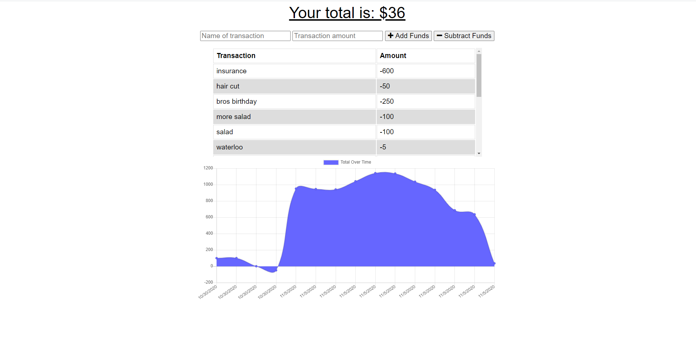

# Progressive Budget Tracker

  
## Description 
The user will be able to add expenses and deposits to their budget with or without a connection. When entering transactions offline, the user can populate the total when brought back online.

## Table of Contents 
* [License](#License)
* [Contributing](#Contributing)
* [Tests](#Tests)
* [Visuals](#Visuals)
* [Links](#Links)
* [Questions](#Questions)

## License
Copyright (c) 2020, Kayla Newlon. (MIT License)

## Contributing 
No guidelines at this time. 

## Tests
Feel free to contact me for any test ideas. 

## Visuals
;

## Links
To Repo: https://github.com/kbnewlon/progressive-budget-tracker
 Visit the deployed app on Heroku to demo: https://progressive-budget-tracker-kbn.herokuapp.com/ 
 

## Questions 
Please contact me if you have any questions at:
 Email: kayla.b.newlon@gmail.com
 Github: https://github.com/kbnewlon